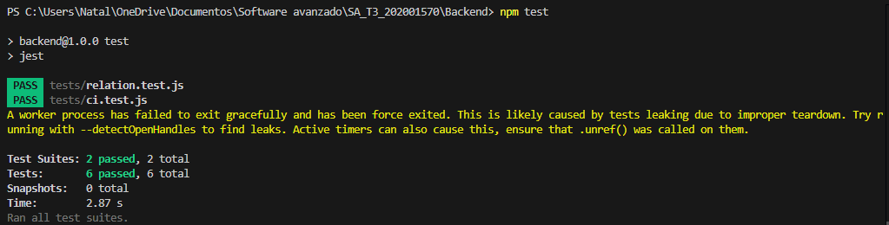
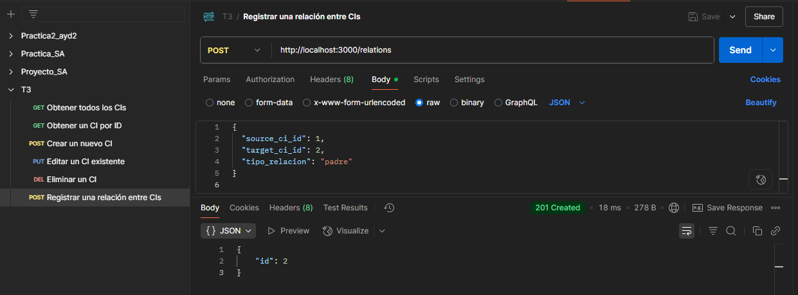
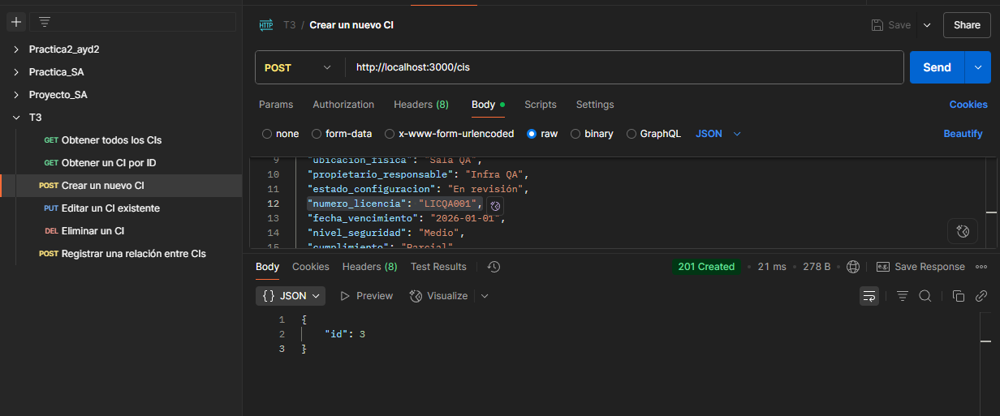

[Regresar](README.md)
# Capturas
En esta sección se presentan evidencias visuales que respaldan la correcta ejecución de las pruebas y el funcionamiento de los endpoints de la API RESTful.

## Capturas de Pruebas Unitarias
Se incluyen imágenes que muestran la ejecución exitosa de las pruebas unitarias realizadas con Jest y Supertest. Estas capturas evidencian que los endpoints para la gestión de Configuration Items y sus relaciones responden correctamente a las peticiones de tipo GET, POST, PUT y DELETE, devolviendo los códigos HTTP esperados y los datos adecuados.

## Capturas de Pruebas en Postman
Se adjuntan capturas del cliente REST Postman, utilizado para probar manualmente los endpoints de la API. 

Estas evidencias visuales aportan confianza en que el sistema está implementado correctamente y responde según lo esperado ante distintas operaciones, tanto automáticas como manuales. 

[Regresar](README.md)