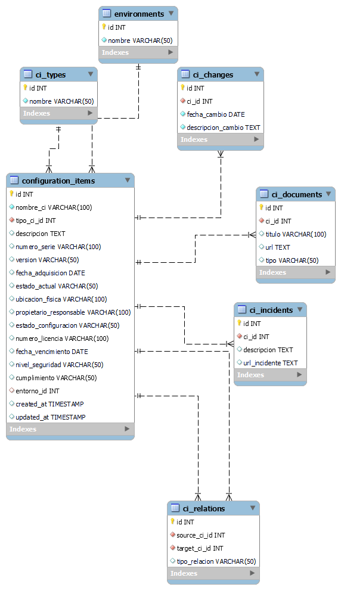

[Regresar](README.md)

# Modelo de Base de Datos
Se crea la base de datos tarea, diseñada para gestionar una CMDB. Esta estructura permite almacenar y relacionar elementos de configuración de forma estructurada, cumpliendo con los lineamientos ITIL.
##  Tabla ci_types
La tabla ci_types se encarga de definir los tipos de elementos de configuración que se gestionarán en la CMDB. Cada registro representa una categoría general como "Servidor", "Aplicación" o "Base de Datos". Esta clasificación permite estandarizar los CIs y facilitar su identificación, agrupación y validación, ya que ciertos campos pueden ser requeridos u opcionales dependiendo del tipo.
##  Tabla environments
La tabla environments contiene los ambientes tecnológicos en los que se encuentran desplegados los elementos de configuración, como DEV (desarrollo), QA (calidad) y PROD (producción). Asociar cada CI con un entorno es crucial para su correcta administración, ya que permite filtrar, auditar o planificar acciones específicas por entorno.
## Tabla configuration_items
Esta es la tabla principal de la CMDB, donde se almacenan todos los datos relevantes de los CIs. Incluye información básica como el nombre, descripción, versión y número de serie, así como metadatos como estado actual, ubicación física, nivel de seguridad, cumplimiento normativo y fechas clave (como adquisición o vencimiento). También contiene claves foráneas hacia ci_types y environments, lo que permite identificar el tipo de CI y su ambiente correspondiente. Además, incorpora campos de auditoría (created_at y updated_at) para rastrear cuándo fue creado o modificado el CI. Esta tabla centraliza la información necesaria para el CRUD completo de los elementos.
## Tabla ci_relations
La tabla ci_relations permite establecer relaciones jerárquicas o funcionales entre los CIs, como por ejemplo que una aplicación depende de un servidor, o que una base de datos es utilizada por una aplicación. Cada relación indica un source_ci_id (el origen o CI superior) y un target_ci_id (el CI dependiente), además de un campo tipo_relacion que describe la naturaleza del vínculo. Esta tabla es clave para modelar la infraestructura de TI como un sistema interconectado, facilitando la visualización de dependencias.
## Tabla ci_changes
La tabla ci_changes sirve para llevar un registro histórico de cambios aplicados a cada CI. Cada entrada incluye el identificador del CI afectado, la fecha del cambio y una descripción detallada del mismo. Esto es fundamental para cumplir con los requisitos de auditoría básica definidos en el control de configuración, y permite rastrear modificaciones como actualizaciones de software, cambios de hardware o traslados físicos.
## Tabla ci_documents
En esta tabla se almacenan referencias a documentos relacionados con los CIs, como manuales, fichas técnicas o guías de configuración. Cada registro indica el título, el tipo de documento y una URL para acceder al mismo. Al estar vinculada directamente a los CIs mediante una clave foránea, esta tabla facilita el acceso a documentación técnica actualizada, mejorando la trazabilidad y el soporte técnico.
## Tabla ci_incidents
La tabla ci_incidents registra incidentes asociados a los CIs, como fallos de hardware, vulnerabilidades detectadas o problemas de rendimiento. Cada incidente contiene una descripción y un enlace (URL) que puede apuntar a un sistema de tickets o reporte. Esta información resulta útil para el análisis histórico, la gestión de riesgos y la mejora continua de los servicios de TI.

[Regresar](README.md)